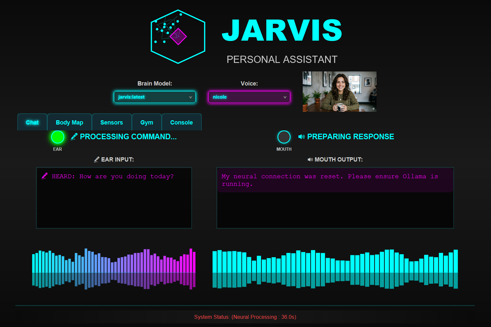
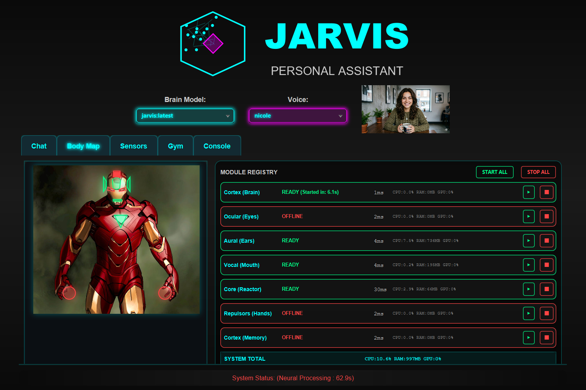
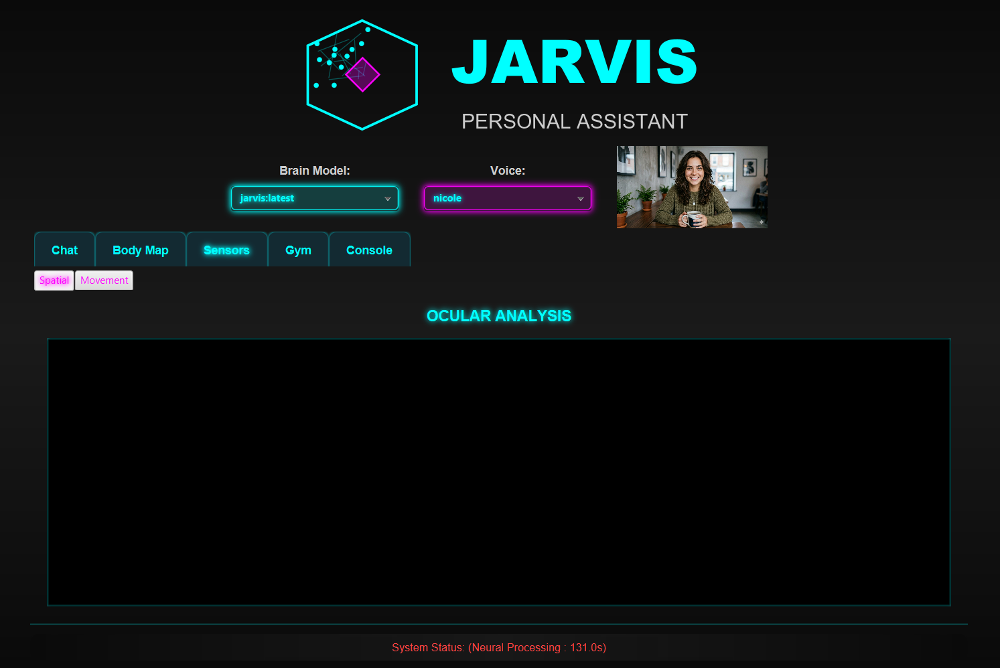
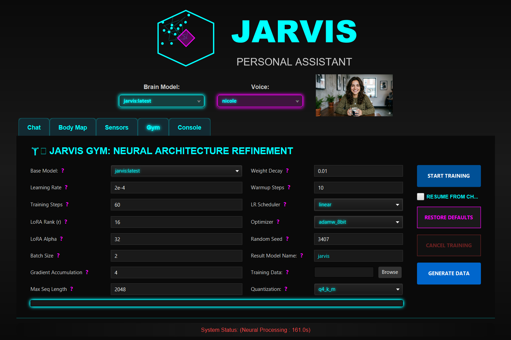
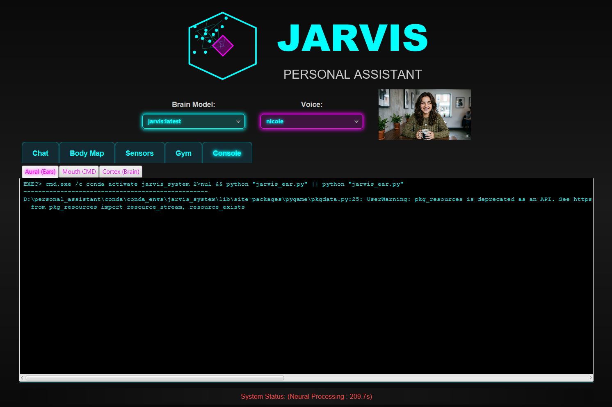
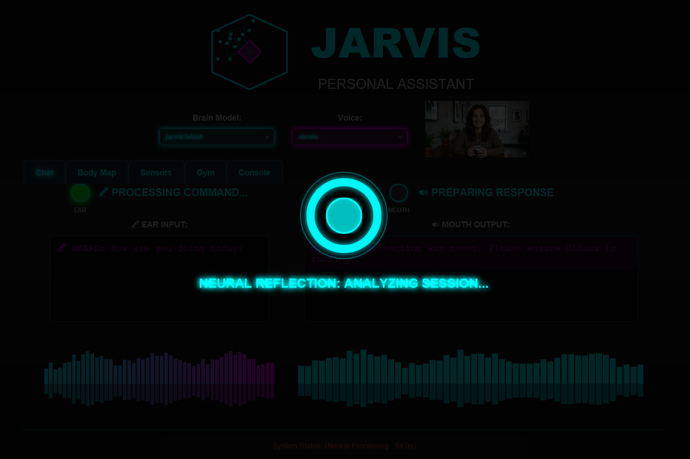

# JARVIS Personal Assistant

A premium-grade AI personal assistant with a sophisticated cyberpunk interface, built with Java and Python integration.

## What JARVIS Can Do (For Fun!)

JARVIS is like having a super-smart robot friend that lives in your computer! Here's what makes JARVIS special:

### **Ears That Listen** 
- JARVIS can hear you when you say its name, just like calling a friend!
- It understands what you're saying and can help you with your questions
- It's like having a robot that's always ready to listen

### **Brain That Thinks**
- JARVIS is super smart and can learn new things
- It can help you with homework, tell stories, or answer questions
- The more you talk to it, the smarter it gets!

### **Mouth That Talks**
- JARVIS can talk back to you in a friendly voice
- It can read stories, sing songs, or just chat with you
- It's like having a talking computer buddy

### **Eyes That See**
- JARVIS can see what's on your computer screen
- It can help you find things or show you cool stuff
- It's like having a robot friend that can look at things with you

### **Magic Hands**
- JARVIS can help you use the computer without touching the keyboard
- It can move the mouse and click buttons for you
- It's like having invisible robot hands helpers!

### **Memory That Remembers**
- JARVIS remembers your conversations and things you like
- It learns about you and becomes a better friend over time
- It never forgets the fun times you've had together!

### **Super Cool Sounds**
- JARVIS makes fun sounds when it's working or helping you
- Beeps, boops, and friendly noises let you know it's listening
- It's like having a robot friend that makes its own music!

JARVIS is like having a whole team of robot friends working together to help you learn, play, and explore on your computer!

## Screenshots

### **Chat Interface**

Interactive chat window where you can talk to JARVIS and get intelligent responses.

### **Body Map**

Visual representation of JARVIS's modular components and their connections.

### **Sensors Dashboard**

Real-time monitoring of all JARVIS sensors and system status.

### **Training Gym**

The training interface where JARVIS learns and improves its capabilities.

### **Console Interface**

The main cyberpunk interface with neural network visualization and status indicators.

### **Shutdown Interface**

The shutdown process showing all components safely powering down.

## Usage

1. **Start the Application**: Run the Java application
2. **Voice Activation**: Say "Jarvis" to activate
3. **Issue Commands**: Speak natural language commands
4. **Administrative Tasks**: Use voice commands for system administration

### Example Commands
- "What time is it?"
- "Open system information"
- "Check disk space"
- "Start notepad"

## Architecture

JARVIS consists of a unified conda environment with modular Python components:

### 1. Brain (jarvis_brain.py)
- **Technology**: Python with Unsloth framework and Ollama integration
- **Purpose**: AI model training, fine-tuning, and reasoning
- **Features**: 
  - Advanced language model training with LoRA
  - Model quantization and Ollama service management
  - Automatic Ollama startup and health checking
  - Support for various model families (Llama, Qwen, Phi, Mistral)

### 2. Ears (jarvis_ear.py)
- **Technology**: Python with Faster-Whisper and OpenWakeWord
- **Purpose**: Voice input processing and wake word detection
- **Features**:
  - Real-time speech-to-text conversion
  - Wake word detection ("Jarvis")
  - GPU/CPU fallback for optimal performance
  - Health monitoring API

### 3. Mouth (jarvis_mouth.py)
- **Technology**: Python with Kokoro TTS and FastAPI
- **Purpose**: Voice output synthesis
- **Features**:
  - High-quality text-to-speech
  - HTTP API for speech generation
  - Multiple voice options

### 4. Actuators (jarvis_actuator.py)
- **Technology**: Python with PyAutoGUI, MediaPipe, and FastAPI
- **Purpose**: Physical OS interaction (Mouse/Keyboard control)
- **Features**:
  - Hand tracking and gesture recognition
  - Eye tracking for cursor control
  - Remote execution of clicks and keystrokes

### 5. Eye (jarvis_eye.py)
- **Technology**: Python with computer vision libraries
- **Purpose**: Visual processing and screen analysis
- **Features**:
  - Screen capture and analysis
  - Object detection
  - Visual context understanding

### 6. Memory (jarvis_memory.py)
- **Technology**: Python with vector database integration
- **Purpose**: Long-term memory and context management
- **Features**:
  - Conversation history storage
  - Context retrieval
  - Learning from interactions

### 7. Sound Manager (jarvis_sound_manager.py)
- **Technology**: Python with pygame
- **Purpose**: Centralized audio management
- **Features**:
  - Sound event system
  - Audio feedback for user interactions
  - Cross-module sound coordination

## Java Desktop Application

The main Java application provides:
- **Cyberpunk UI**: Metallic interface with neon accents
- **Audio Visualizers**: Dynamic waveform displays
- **Administrative Access**: Secure command execution with elevated privileges
- **System Integration**: Full control over Windows administrative functions

## Installation

### Prerequisites
- Java 17 or higher
- Maven 3.6 or higher
- Anaconda/Miniconda
- Python 3.10
- NVIDIA GPU (recommended for optimal performance)
- CUDA 11.8+ (for GPU acceleration)
- Ollama (for local AI model serving)

### Conda Environment Setup

The JARVIS project uses a **unified conda environment** for simplified dependency management.

#### 1. Create Unified Conda Environment
```bash
# Create the unified JARVIS environment
conda env create -f conda/jarvis_system.yml

# Verify environment is created
conda env list
```

#### 2. Environment Overview
- **`jarvis_system`**: Complete JARVIS environment with all dependencies
  - AI/ML: Unsloth, PyTorch, Transformers, Ollama
  - Audio: Faster-Whisper, OpenWakeWord, Kokoro TTS, PyAudio
  - Vision: MediaPipe, OpenCV, PyAutoGUI
  - Web: FastAPI, uvicorn, requests
  - Utilities: pygame, numpy, psutil

#### 3. Activate Environment
```bash
# Activate the unified environment
conda activate jarvis_system
```

#### 4. Ollama Setup
```bash
# Install Ollama (if not already installed)
# Visit: https://ollama.ai/download

# Pull a base model (optional, will be handled automatically)
ollama pull llama3.2:3b
```

### Setup Steps

1. **Clone/Download project**

2. **Create unified conda environment**:
   ```bash
   conda env create -f conda/jarvis_system.yml
   ```

3. **Verify environment exists**:
   ```bash
   conda env list
   ```
   You should see: `jarvis_system`

4. **Activate environment**:
   ```bash
   conda activate jarvis_system
   ```

5. **Build Java application**:
   ```bash
   mvn clean compile
   ```

6. **Run JARVIS**:
   ```bash
   mvn javafx:run
   ```

## Features

### UI Components
- **Central Emblem**: Crystalline shield with neural network visualization
- **Dynamic Waveforms**: Real-time audio visualizers
- **Status Indicators**: System status and activity monitoring
- **Cyberpunk Aesthetics**: Neon-blue and obsidian color scheme

### Administrative Capabilities
- **Command Execution**: Secure admin command processing
- **System Information**: Real-time system monitoring
- **Safety Validation**: Prevents dangerous operations
- **Elevated Privileges**: Full administrative access when needed

### AI Integration
- **Voice Commands**: Natural language processing
- **Context Awareness**: Intelligent response generation
- **Learning Capability**: Model training and fine-tuning
- **Multi-modal**: Voice input/output with visual feedback

## Configuration

### Python Scripts Location
All Python modules are:
```
 jarvis_brain.py           # AI model training and reasoning
 jarvis_ear.py             # Voice input processing
 jarvis_mouth.py           # Voice output synthesis
 jarvis_actuator.py        # System control and gestures
 jarvis_eye.py             # Visual processing
 jarvis_memory.py          # Long-term memory management
 jarvis_sound_manager.py   # Audio feedback system
 jarvis_utils.py           # Shared utilities
```

### Module APIs
Each module provides FastAPI health endpoints:
- **Brain**: `http://127.0.0.1:8082/health`
- **Ears**: `http://127.0.0.1:8081/health`
- **Actuators**: `http://127.0.0.1:8084/health`
- **Mouth**: `http://127.0.0.1:8880/health`

### Conda Environment
- `jarvis_system`: Unified environment with all dependencies

### Model Storage
- **Training outputs**: `scripts/models/jarvis_build/`
- **Checkpoints**: `scripts/models/jarvis_build/checkpoints/`
- **Ollama models**: Managed by Ollama service

## Development

### Project Structure
```
src/main/java/com/jarvis/
├── JarvisApplication.java     # Main application and UI
├── JarvisController.java      # System controller
├── PythonService.java         # Python integration
├── AdminCommandService.java   # Administrative commands
└── AudioVisualizer.java       # Audio visualization
```

## Security

The administrative command service includes:
- **Command Validation**: Blocks dangerous operations
- **Path Protection**: Prevents access to critical system areas
- **Elevated Execution**: Secure privilege escalation
- **Audit Logging**: Complete command history

## Troubleshooting

### Common Issues

1. **Conda Environment Not Found**:
   - Run `conda env create -f conda/jarvis_system.yml` to create jarvis environment
   - Ensure conda is in your PATH

2. **Python Script Errors**:
   - Check script permissions
   - Verify dependencies are installed
   - Check GPU drivers for CUDA operations

3. **JavaFX Issues**:
   - Ensure Java 17+ is installed
   - Check Maven JavaFX plugin configuration

4. **Audio Problems**:
   - Verify microphone permissions
   - Check audio device settings
   - Ensure PyAudio is properly installed

### Logs
- Java application logs: Console output
- Python scripts: Individual script logs
- System events: Windows Event Viewer

## License

This project is for educational and personal use. Please ensure compliance with all applicable licenses for the included dependencies.

## Support

For issues and questions:
1. Check the troubleshooting section
2. Review the logs for error messages
3. Verify all prerequisites are installed
4. Test individual components separately

---

**JARVIS** - Your Premium AI Personal Assistant
